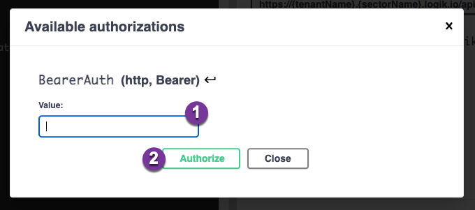

# API-Documentation

 The goal of this repository and the content is to provide a fast start for developers exploring or working with the Logik APIs. The aim is to keep this as complete and up to date as possible, but exhaustiveness and absolute correctness is not guaranteed.

 For more detailed information see the [Logik&period;io Support Portal](https://logikio3.my.site.com/s/article/Logik-io-Runtime-APIs)

## Logik&period;io Runtime APIs

Logik&period;io provides a set of APIs for building front end applications and manipulating configurations. These are commonly referred to as “buyside” or “runtime” APIs that are used by customers or end users to create, update and save Logik configurations.

The Runtime APIs support the standard CRUD (Create, Read, Update, Delete) functions for Logik configurations, along with the ability to retrieve Bill of Materials (BOM) data from Logik.

**Important:**
> Real API calls will be made to the Logik Instance that you authorize, take special care if you are using a production environment versus a test. Data can be persisted in Logik and if connections are configured to external systems, additional downstream effects may occur.
>

### Logik Configuration

For either Postman or Swagger you will first need to generate a Runtime Client. To create a runtime client in the Logik&period;io Admininstration page of your instance for authentication access to the APIs. You will need both the `Runtime Token` and the `Origin` of your runtime client for both.
The allowed Origin is different depending on using Postman or the Swagger Editor.

- Postman
  - Origin: `<Any value you want>`, `localhost` is a common choice
- Swagger Editor
  - Origin: `https://editor.swagger.io/`, if using the online editor linked below

See [Authenticating Logik API Calls](https://logikio3.my.site.com/s/article/Authenticating-Logik-API-Calls) for a detailed walkthrough.

### Postman Collection

A Postman collection for commonly used Runtime APIs is provided in this repository to allow for easy testing and usage of the provided Runtime APIs.

[Logik Postman Collection](/Logik%20Configurator%20Runtime%20APIs.postman_collection.json)

This Collection contains 3 folders grouping the API calls

- Configuration APIs: Working with Logik Configurations, supporting all common CRUD actions.
- BOM APIs: Getting Bill of Materials (BOM) data from Logik, based on a specific Configuration Id.
- Layout APIs: Getting a Layout JSON for a specific Blueprint Layout.

Each API call comes with at least one example of a successful API call & response. These can be used as a reference for what some of the responses might look like. Individual responses will vary based on the configuration of your Logik product, fields and rules.

The majority of the Postman API calls have scripts in the "Tests" tab of the requests to set or update the collection variables dynamically based on the response of the request.

**See Also:**

- [Logik.io Support site for detailed Runtime API documentation](https://logikio3.my.site.com/s/article/Intro-to-API-Calls)

#### Postman Prerequisites

- A Logik&period;io Instance
- [Postman Client](https://www.postman.com/downloads/)

#### Postman Configuration

1. To import the Postman Collection, click "Import"

1. In the import modal, click "Upload Files" to select the Postman Collection to import

1. To confirm the import of the collection, click "Import"

There are 4 variables (`baseUrl`, `runtimeToken`, `origin`, `configProductId`) that are required to be set to start using the postman collection. The last 2 variables (`uuid`, `layoutUrl`) that can be set automatically when running the requests for use in subsequent requests, or set to a specific value for testing.

1. Find the Collection that has been imported, click on the top level folder
1. Click on the "Variables" tab to view and edit the variables that are used in the collection
1. `baseUrl`\* - the Logik&period;io API URL to send the API calls to. In the format of `https://<tenant>.<sector>.logik.io/api` (Note no trailing slash on the URL) *\*Required*
    - `<tenant>` - is the Logik tenant of your instance, which will be specific to your deployment
    - `<sector>` - is the Logik Sector of your instance, generally `test` or `prod`
1. `runtimeToken`\* - the Runtime Token, used to authenticate API calls as defined in the [Runtime Client setup in Logik](https://logikio3.my.site.com/s/article/Authenticating-Logik-API-Calls) *\*Required*
1. `origin`\* - the origin, as defined in the [Runtime Client setup in Logik](https://logikio3.my.site.com/s/article/Authenticating-Logik-API-Calls) *\*Required*
1. `configProductId`\* - this is the Id of the Configurable Product to use for the Configuration calls. This must be a Logik enabled Product with a deployed blueprint. *\*Required*
1. `uuid` - the Logik Configuration Id for a specific configuration. This will be set automatically when initalizing a new configuration, but can be specified here if you want to test or use a specifc Configuration Id. *Optional*
1. `layoutUrl` - The URL of the layout to load. This will be set automatically when initalizing a new configuration, but can be specified here if you want to test or use a specifc Layout. *Optional*

1. Finally after setting at least the `baseUrl`, `runtimeToken`, `origin`, and `configProductId` variables, Save to persist the changes

Now the Postman Collection should be configured to make requests to your Logik Instance

For using each of the APIs, please see the [Logik.io Support site for detailed Runtime API documentation](https://logikio3.my.site.com/s/article/Logik-io-Runtime-APIs)

### Swagger (OpenAPI) Documentation

A Swagger (OpenAPI) file documenting the Logik Runtime APIs, with example responses and schema(s) supported.

[Logik Swagger Runtime File](/endUserAPIExample.yml)

This Swagger file has 3 sections, mostly overlapping with the Postman collection as well.

- Configuration APIs: Working with Logik Configurations, supporting common CRUD actions.
- BOM APIs: Getting Bill of Materials (BOM) data from Logik, based on a specific Configuration Id.
- Schemas: Schemas that different parts of the API uses.

Each API call has a basic structure of any response body that might be included in the call and potential responses. The aim is to keep this as complete and up to date as possible, but exhaustiveness is not guaranteed.

#### Swagger Prerequisites

Swagger provides a free online editor that can be used for exploring an OpenAPI Spec and testing out calls.

- A Logik&period;io Instance
- [Swagger Editor](https://editor.swagger.io/)

#### Swagger Setup

1. To get started navigate to the Swagger Editor, at the top click the dropdown for "File".
1. Select "Import File" to import the yml file provided in this repo.

1. Ensure that the yml file was correctly imported into the editor window
1. `tenantName` -  is the Logik tenant of your instance, which will be specific to your deployment
1. `sectorName` - is the Logik Sector of your instance, generally `test` or `prod`
1. Finally you will need to authorize with the Runtime Token created in [Logik Config](#logik-configuration). Click "Authorize" to launch the authorization modal.

1. Enter the value of the runtime token that was generated in [Logik Config](#logik-configuration), ensure that the origin is correct for the URL in the browser: `https://editor.swagger.io/`
1. Save the Runtime Token by clicking the "Authorize" button

Now the Swagger Editor should be configured to make requests to your Logik Instance

For using each of the APIs, please see the [Logik.io Support site for detailed Runtime API documentation](https://logikio3.my.site.com/s/article/Logik-io-Runtime-APIs)

## Logik&period;io Admin APIs

Logik&period;io provides access to the admin APIs for automating and managing the setup of Logik&period;io from the Administrative side.

Current APIs

- Managed Tables

**Important:**
> Real API calls will be made to the Logik Instance that you authorize, take special care if you are using a production environment versus a test. Data can be persisted in Logik and if connections are configured to external systems, additional downstream effects may occur.
>

## Additional Resources

- [Logik.io Support site for detailed Runtime API documentation](https://logikio3.my.site.com/s/article/Logik-io-Runtime-APIs)
- [Postman API Client](https://www.postman.com/)
- [Swagger Editor](https://editor.swagger.io/)
- [OpenAPI Specification](https://swagger.io/specification/)
